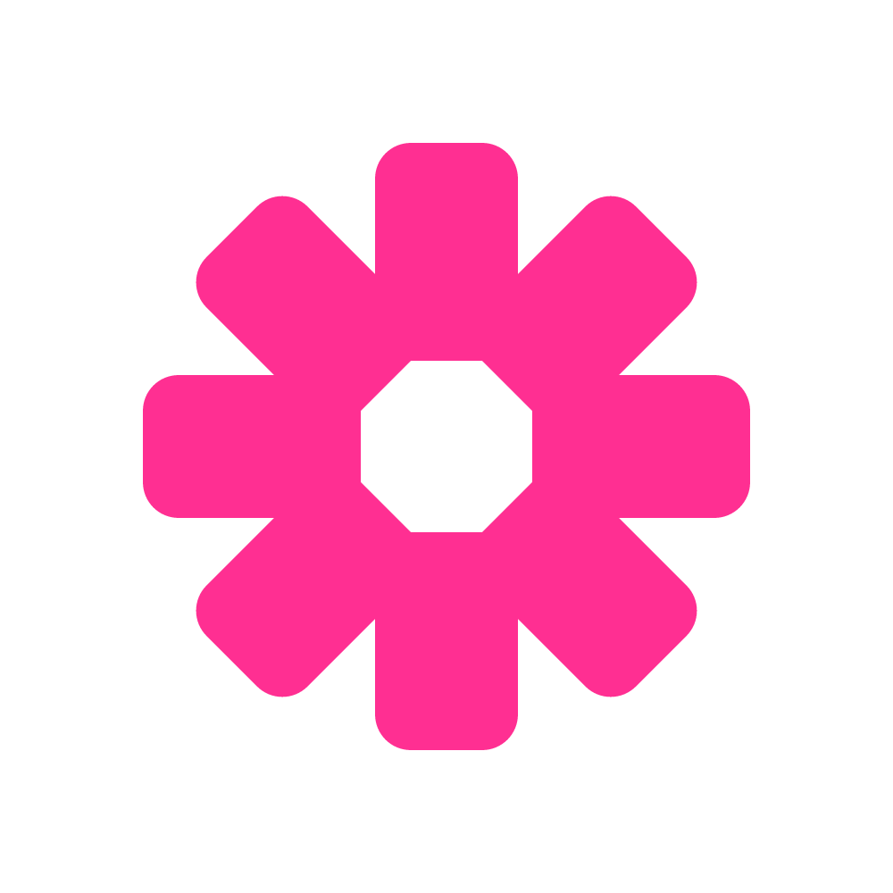

<div align="center">



# KYBERIA TECH

**Create. Design. Innovate.**

*Cairo-based global creative & technology studio*

---

[](https://kyberia.tech)
[](https://kyberia.tech)
[](https://kyberia.tech)
[](https://kyberia.tech)

</div>

---

## What We Do

Kyberia Tech is a creative and technology studio with one core belief: **creative thinking, engineering discipline**. We build brands, design systems, and develop digital products for clients across 9 countries.

We don't separate strategy from execution. We don't sell hype. We define the foundation, build the system, and deliver results that hold.

---

## Services

### 01 — Branding & Strategy
Positioning, naming, visual identity, messaging architecture, and brand guidelines. We build the foundation others build on.

### 02 — Graphic Design
Logo design, UI/UX, video production, photography, drone, motion, animation, and print/digital collateral. Every asset built to system.

### 03 — Web Design & Development
Custom websites, e-commerce, mobile apps (iOS & Android), AR/VR experiences, and bespoke software. From concept to deployment.

---

## The Kyberia Method

Every project runs through six phases. No exceptions.

| Phase | Name | Output |
|-------|------|--------|
| `01` | Discovery & Diagnosis | Brief, research, competitive audit |
| `02` | Strategy & Project Baseline | Scope, timeline, cost baseline |
| `03` | Creative & Technical Strategy | Direction, architecture, rationale |
| `04` | Design, Build & Iterate | Deliverables, sprints, feedback loops |
| `05` | Review, QA & Sign-Off | Testing, refinement, approval |
| `06` | Delivery, Handover & Support | Launch, documentation, long-term support |

---

## Pricing

Transparent from day one.

**Branding**

| Package | Scope | Investment |
|---------|-------|------------|
| Brand Starter | Positioning + core identity | $800 – $1,500 |
| Brand Standard | Full identity system | $1,500 – $3,000 |
| Brand Full | Strategy + full identity + guidelines | $3,000 – $6,000 |

**Web**

| Package | Scope | Investment |
|---------|-------|------------|
| Landing Page | Single-page site | $600 – $1,200 |
| Business Site | Multi-page custom site | $1,500 – $4,000 |
| Premium Site | Custom design + advanced build | $4,000 – $10,000+ |

**Bundles**

| Package | Includes | Investment |
|---------|----------|------------|
| Launch Package | Brand + Web | $4,000 – $6,500 |
| Scale Package | Brand + Web + Content | $8,000 – $15,000 |
| Retainer | Ongoing support & delivery | $2,000 – $4,000/mo |

> **Terms:** 50% deposit to begin. 50% on delivery. Rush projects carry a 30% premium.

---

## Markets

```
🇸🇦 Saudi Arabia    🇰🇷 South Korea    🇦🇺 Australia
🇩🇪 Germany         🇺🇸 United States  🇯🇵 Japan
🇪🇬 Egypt           🇮🇳 India          🇦🇪 UAE
```

---

## Brand

| Token | Value |
|-------|-------|
| Primary Pink | `#FF2F92` |
| Pink Light | `#FF5CAD` |
| Pink Dark | `#CC0066` |
| Black | `#000000` |
| White | `#FFFFFF` |
| Display Font | Spline Sans |
| Body Font | Satoshi |
| Mono Font | Spline Sans Mono |

Brand archetype: **The Architect × The Innovator**
Brand voice: Confident. Precise. Direct. No hype.

---

## Founder

**Abdelfattah Mohammed**
Founder · Lead Web Developer · Business Developer

Background in civil engineering and project controls (schedule, cost, management consultancy). MSc Project Management — Liverpool John Moores University. Leading Kyberia Tech from founding through every client engagement.

---

## Contact

| Channel | Link |
|---------|------|
| Website | [kyberia.tech](https://kyberia.tech) |
| Email | hello@kyberia.tech |
| LinkedIn | [@kyberiatech](https://linkedin.com/company/kyberiatech) |
| X / Twitter | [@kyberiatech](https://x.com/kyberiatech) |

---

## Part of Peridot Holding

Kyberia Tech operates alongside a sister architecture and interior design studio under **Peridot Holding** — bringing creative and spatial disciplines under one group.

---

<div align="center">

*© 2026 Kyberia Tech · Cairo, Egypt · All rights reserved*

**Create. Design. Innovate.**

</div>
